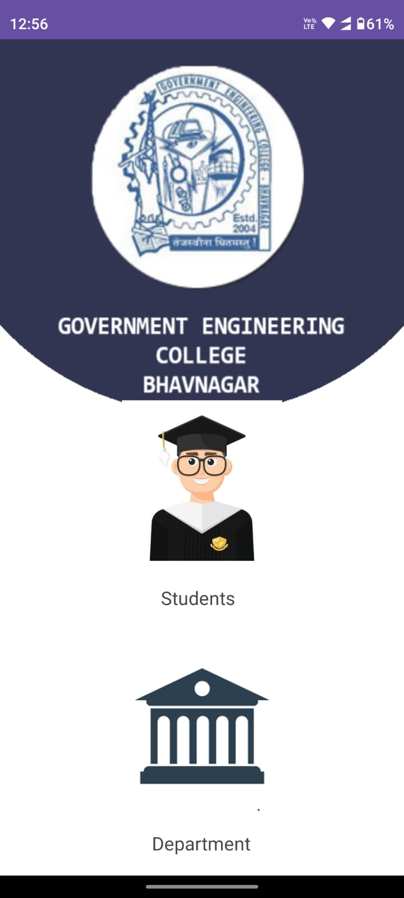

# College Department Management

An Android app for managing student and department notices, uploads, and authentication for a college environment.

## Overview

**College Department Management** is an Android application designed to streamline communication and information sharing between students and college departments. The app allows departments to upload notices (as images or PDFs) and students to view or download them. The app supports user authentication for both students and department staff, leveraging Firebase for authentication and real-time data storage.

---

## Features

- **Student Authentication**: Students can sign up and log in to view department notices.
- **Department Login**: Secure login for department staff to upload new notices.
- **Notice Upload**: Departments can upload images and PDFs as notices, along with title and description.
- **Notice Feed**: Students view a searchable, scrollable list of notices, sorted by upload time.
- **Download Support**: Students can download notices to their device.
- **Detail View**: Tap on a notice to view full details (title, image/pdf, description).
- **Real-time Database**: Uses Firebase Realtime Database and Storage for storing user data and uploaded files.
- **Modern UI**: Material Design components, CardViews, and custom UI for an engaging experience.

---

## Screenshots

**Welcome Screen**


**Student Signup**


**Student Login**


**Notice Page - Search & Download**


**Notice Detail View**


**Faculty Login**


**Adding a Notice (Department)**


---

## Tech Stack

- **Language**: Java
- **Platform**: Android
- **Firebase Services**:
  - Firebase Authentication (for department login)
  - Firebase Realtime Database (for storing user and notice data)
  - Firebase Storage (for storing uploaded files)
- **Libraries**:
  - [Glide](https://github.com/bumptech/glide) (image loading)
  - [Material Components](https://material.io/components)
  - AndroidX libraries

---

## Project Structure

```
app/
 ├─ src/
 │   ├─ main/
 │   │   ├─ java/com/ce/gec/
 │   │   │   ├─ DataClass.java         # Notice data model
 │   │   │   ├─ DeptLogin.java         # Department Login Activity
 │   │   │   ├─ DeptMainActivity.java  # Department main (upload) screen
 │   │   │   ├─ DetailActivity.java    # Notice detail view
 │   │   │   ├─ Login.java             # Student Login Activity
 │   │   │   ├─ MainActivity.java      # Student main (notice feed) screen
 │   │   │   ├─ MyAdapter.java         # RecyclerView adapter for notices
 │   │   │   ├─ Signup.java            # Student Signup Activity
 │   │   │   ├─ Support.java           # Student data model
 │   │   │   └─ Welcome.java           # Welcome/landing screen
 │   │   └─ res/
 │   │       ├─ layout/                # XML UI layouts
 │   │       ├─ drawable/              # App images/icons
 │   │       └─ ...
 ├─ images/                            # App screenshots (for README)
 ├─ build.gradle.kts
 └─ ...
```

---

## Getting Started

### Prerequisites

- Android Studio (Arctic Fox or later)
- Firebase project (see below)
- Internet connection (for Firebase)

### Setup Instructions

1. **Clone this repository:**

   ```bash
   git clone https://github.com/dhruv-ambaliya/College-Department-Management.git
   ```

2. **Open in Android Studio**

3. **Configure Firebase:**

   - Go to [Firebase Console](https://console.firebase.google.com/)
   - Create a new Firebase project.
   - Add an Android app to the project. Use the package name: `com.ce.gec`
   - Download the `google-services.json` file and place it in `app/` directory.
   - Enable **Authentication** (Email/Password) and **Realtime Database** in Firebase console.
   - Enable **Firebase Storage** for file uploads.

4. **Build and Run**

   - Connect your Android device or use an emulator.
   - Click "Run" in Android Studio.

---

## Usage

- **Students**: Sign up or log in with your enrollment number and password. View and download department notices.
- **Departments**: Log in with department credentials. Upload new notices with images or PDFs for students.
- **Notice Feed**: View all uploaded notices, use the search bar to filter by title, and download any notice.

---

## Customization

- **UI**: Update `res/layout/` files for custom interfaces.
- **Branding**: Change images in `res/drawable/` for your institution's branding.
- **Features**: Extend user roles, add notification support, or implement analytics as needed.

---

## Contributing

Contributions are welcome! Please fork the repository and submit a pull request for review.

---

## License

This project is licensed under the [Apache License 2.0](https://www.apache.org/licenses/LICENSE-2.0).

---

## Acknowledgements

- [Firebase](https://firebase.google.com/)
- [Glide](https://github.com/bumptech/glide)
- [Android Material Components](https://material.io/components)
